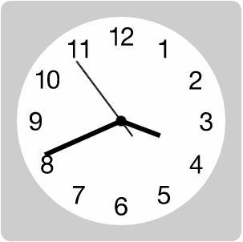
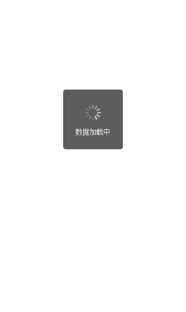
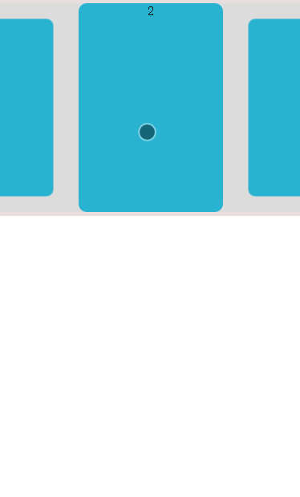

#Demo

一些demo记录

##Demo List

###Clocks
CSS和Javascript实现简单时钟

[原文参考](https://cssanimation.rocks/clocks/)

###weuiLoading
WeUI Loading Demo

[WeUI-Github](https://github.com/weui/weui)

[WeUI](http://weui.github.io/weui/)

###EventUtil.js
跨浏览器事件相关方法参考

* 添加/删除事件处理程序 addHandler/removeHandler
* event对象引用
* 事件目标
* 取消事件的默认动作 preventDefault
* 阻止当前事件的进一步冒泡行为 stopPropagation
* 相关元素 getRelatedTarget
* 鼠标按钮 getButton
* 鼠标滚轮事件 getWheelDelta
* 字符编码 getCharCode

*参考：JavaScript高级程序设计（第3版）*

###SlideShow
展示型轮播Demo

基于jQuery/Zepto,焦点处放大，其他部分缩小。可以商品新闻等展示，内容可以图片文字等。

暂时是个简陋原型，功能性和兼容性还需要不断完善。

后续可以写成无依赖插件。

